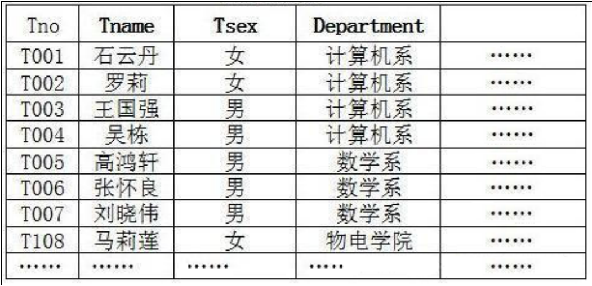
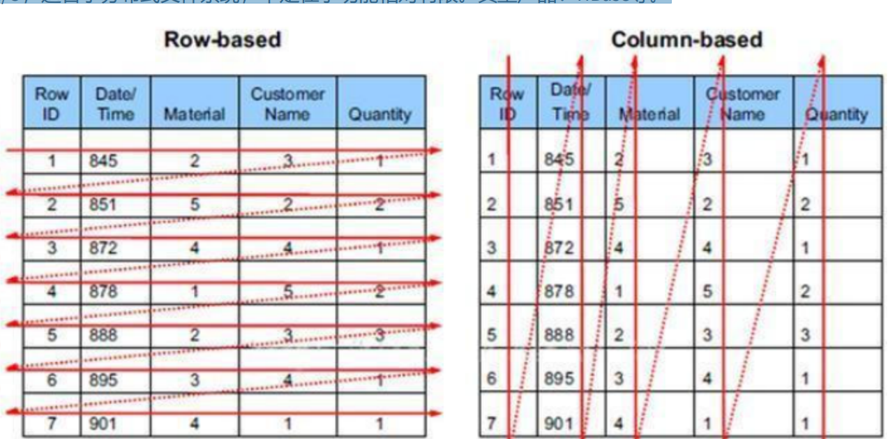

# 1.RDBMS和非RDBMS

从排名中我们能看出来，关系型数据库绝对是 DBMS 的主流，其中使用最多的 DBMS 分别是 Oracle、 MySQL 和 SQL Server。这些都是关系型数据库（RDBMS）。

# 2.关系型数据库

## 1.实质

这种类型的数据库是 最古老 的数据库类型，关系型数据库模型是把复杂的数据结构归结为简单的二元关系 （即二维表格形式）。关系型数据库以 行(row) 和 列(column) 的形式存储数据，以便于用户理解。这一系列的行和列被称为表,一组表组成一个库

表与表之间的数据记录有关系,现实世界中的各种实体之间的各种联系均用关系模型来表示,关系型数据库,就是建立在关系基础上的数据库

SQL就是关系型数据库的查询语言

## 2.优势

- **复杂查询** 可以用SQL语句方便的在一个表以及多个表之间做非常复杂的数据查询。
- **事务支持** 使得对于安全性能很高的数据访问要求得以实现。

# 3.非关系型数据库

## 1.介绍

**非关系型数据库**，可看成传统关系型数据库的功能 阉割版本 ，基于键值对存储数据，不需要经过SQL层

的解析， 性能非常高 。同时，通过减少不常用的功能，进一步提高性能。

目前基本上大部分主流的非关系型数据库都是免费的

相比于 SQL，NoSQL 泛指非关系型数据库，包括了榜单上的键值型数据库、文档型数据库、搜索引擎和

列存储等，除此以外还包括图形数据库。也只有用 NoSQL 一词才能将这些技术囊括进来。

## 2.键值型数据库

键值型数据库通过 Key-Value 键值的方式来存储数据，其中 Key 和 Value 可以是简单的对象，也可以是复

杂的对象。Key 作为唯一的标识符，优点是查找速度快，在这方面明显优于关系型数据库，缺点是无法

像关系型数据库一样使用条件过滤（比如 WHERE），如果你不知道去哪里找数据，就要遍历所有的键，

这就会消耗大量的计算。

键值型数据库典型的使用场景是作为 内存缓存 。 Redis 是最流行的键值型数据库

## 3.文档型数据库

此类数据库可存放并获取文档，可以是XML、JSON等格式。在数据库中文档作为处理信息的基本单位，

一个文档就相当于一条记录。文档数据库所存放的文档，就相当于键值数据库所存放的“值”。MongoDB

是最流行的文档型数据库。此外，还有CouchDB等

## 4.搜索引擎数据库

虽然关系型数据库采用了索引提升检索效率，但是针对全文索引效率却较低。搜索引擎数据库是应用在

搜索引擎领域的数据存储形式，由于搜索引擎会爬取大量的数据，并以特定的格式进行存储，这样在检

索的时候才能保证性能最优。核心原理是“倒排索引”。

典型产品：Solr、Elasticsearch、Splunk 等。

## 5.列式数据库

列式数据库是相对于行式存储的数据库，Oracle、MySQL、SQL Server 等数据库都是采用的行式存储

（Row-based），而列式数据库是将数据按照列存储到数据库中，这样做的好处是可以大量降低系统的

I/O，适合于分布式文件系统，不足在于功能相对有限。典型产品：HBase等。

## 6.图形数据库

图形数据库顾名思义，就是一种存储图形关系的数据库。它利用了图这种数据结构存储了实体（对象）

之间的关系。关系型数据用于存储明确关系的数据，但对于复杂关系的数据存储却有些力不从心。如社

交网络中人物之间的关系，如果用关系型数据库则非常复杂，用图形数据库将非常简单。典型产品：

Neo4J、InfoGrid等。