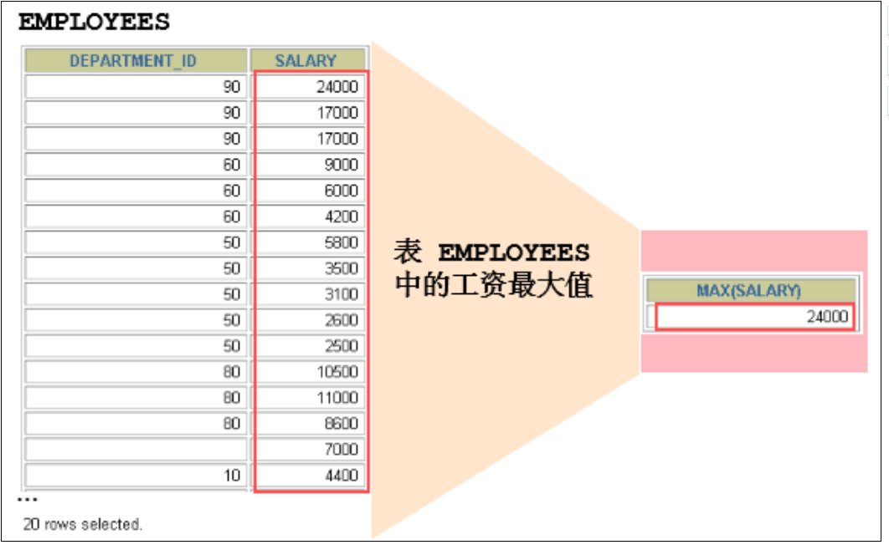
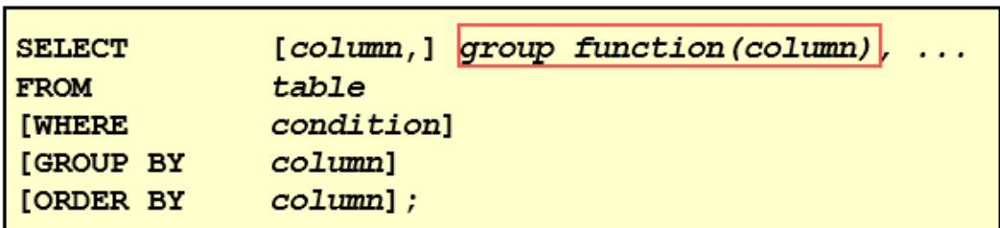
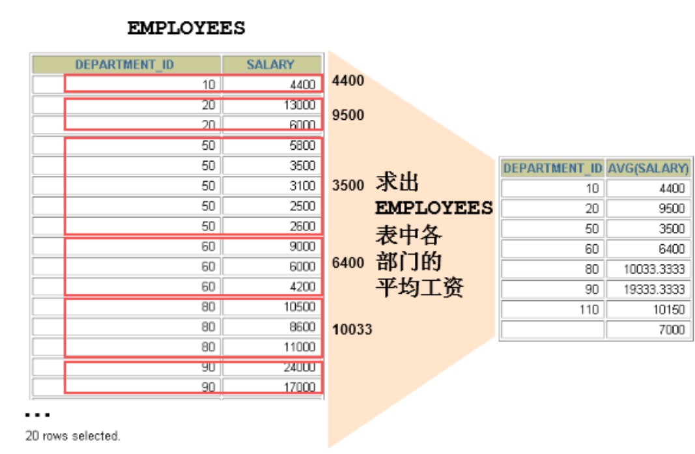
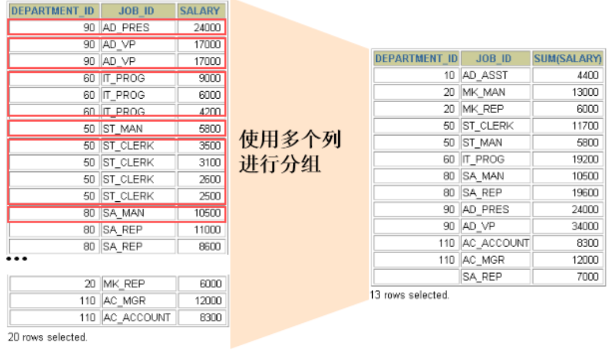
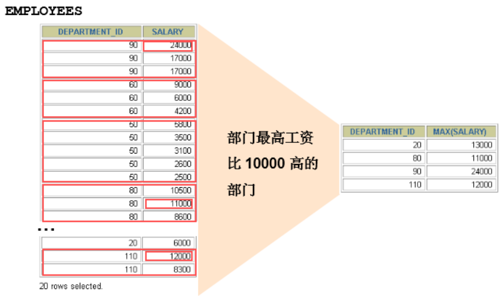
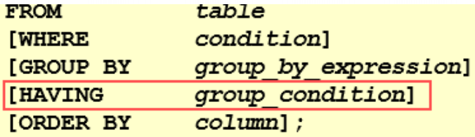

# 1.聚合函数介绍

聚合函数作用于一组数据，并对一组数据返回一个值。



# 2.聚合函数类型

1. **AVG()** 
2. **SUM()** 
3. **MAX()** 
4. **MIN()** 
5. **COUNT()**

# 3.聚合函数语法



# 4.AVG和SUM函数

可以对**数值型数据**使用AVG 和 SUM 函数。

```sql
SELECT AVG(salary), MAX(salary),MIN(salary), SUM(salary) FROM employees WHERE job_id LIKE '%REP%';
```

# 5. MIN和MAX函数

可以对**任意数据类型**的数据使用 MIN 和 MAX 函数。

```sql
SELECT MIN(hire_date), MAX(hire_date) FROM employees;
```

# 6.COUNT函数

COUNT(*)返回表中记录总数，适用于**任意数据类型**。 

```sql
SELECT COUNT(*) FROM employees WHERE department_id = 50;
```

COUNT(expr) 返回**expr****不为空**的记录总数

```sql
SELECT COUNT(commission_pct) FROM employees WHERE department_id = 50;
```

**问题：用****count(\*)****，****count(1)****，****count(****列名****)****谁好呢****?**

其实，对于MyISAM引擎的表是没有区别的。这种引擎内部有一计数器在维护着行数。

Innodb引擎的表用count(*),count(1)直接读行数，复杂度是O(n)，因为innodb真的要去数一遍。但好

于具体的count(列名)。

**问题：能不能使用****count(****列名****)****替换****count(\*)?**

不要使用 count(列名)来替代 count(*) ， count(*) 是 SQL92 定义的标准统计行数的语法，跟数

据库无关，跟 NULL 和非 NULL 无关。

说明：count(*)会统计值为 NULL 的行，而 count(列名)不会统计此列为 NULL 值的行。

# 7.基本的使用



**可以使用****GROUP BY****子句将表中的数据分成若干组**

```sql
SELECT column, group_function(column) FROM table [WHERE condition] [GROUP BY group_by_expression] [ORDER BY column];
```

**明确：****WHERE****一定放在****FROM****后面**

**在****SELECT****列表中所有未包含在组函数中的列都应该包含在** **GROUP BY****子句中**

```sql
SELECT department_id, AVG(salary) FROM employees GROUP BY department_id ;
```

包含在 GROUP BY 子句中的列不必包含在SELECT 列表中

```sql
GROUP BY department_id ;
```

# 8.使用多个列分组



```sql
SELECT department_id dept_id, job_id, SUM(salary) FROM employees GROUP BY department_id, job_id ;
```

使用 WITH ROLLUP 关键字之后，在所有查询出的分组记录之后增加一条记录，该记录计算查询出的所

有记录的总和，即统计记录数量。

```sql
SELECT department_id,AVG(salary) FROM employees WHERE department_id > 80 GROUP BY department_id WITH ROLLUP;
```

注意：

当使用ROLLUP时，不能同时使用ORDER BY子句进行结果排序，即ROLLUP和ORDER BY是互相排斥

的。


# 9.HAVING

## 1.基本的使用



## 2.过滤分组

1. 行已经被分组。

2. 使用了聚合函数。

3. 满足HAVING 子句中条件的分组将被显示。

4. HAVING 不能单独使用，必须要跟 GROUP BY 一起使用



```sql
SELECT department_id, MAX(salary) FROM employees GROUP BY department_id HAVING MAX(salary)>10000 ;
```

**非法使用聚合函数 ： 不能在** **WHERE** **子句中使用聚合函数。**如下：

```sql
SELECT department_id, AVG(salary) FROM employees WHERE AVG(salary) > 8000 GROUP BY department_id;
```


# 10.where和having的对比

**区别****1****：****WHERE** **可以直接使用表中的字段作为筛选条件，但不能使用分组中的计算函数作为筛选条件；**

**HAVING** **必须要与** **GROUP BY** **配合使用，可以把分组计算的函数和分组字段作为筛选条件。**

这决定了，在需要对数据进行分组统计的时候，HAVING 可以完成 WHERE 不能完成的任务。这是因为，

在查询语法结构中，WHERE 在 GROUP BY 之前，所以无法对分组结果进行筛选。HAVING 在 GROUP BY 之

后，可以使用分组字段和分组中的计算函数，对分组的结果集进行筛选，这个功能是 WHERE 无法完成

的。另外，WHERE排除的记录不再包括在分组中。

**区别****2****：如果需要通过连接从关联表中获取需要的数据，****WHERE** **是先筛选后连接，而** **HAVING** **是先连接**

**后筛选。** 这一点，就决定了在关联查询中，WHERE 比 HAVING 更高效。因为 WHERE 可以先筛选，用一

个筛选后的较小数据集和关联表进行连接，这样占用的资源比较少，执行效率也比较高。HAVING 则需要

先把结果集准备好，也就是用未被筛选的数据集进行关联，然后对这个大的数据集进行筛选，这样占用

的资源就比较多，执行效率也较低。


小结:

WHERE                先筛选数据再关联，执行效率高 ,不能使用分组中的计算函数进行筛选

HAVING                可以使用分组中的计算函数 ,在最后的结果集中进行筛选，执行效率较低


开发中的选择:

WHERE 和 HAVING 也不是互相排斥的，我们可以在一个查询里面同时使用 WHERE 和 HAVING。包含分组

统计函数的条件用 HAVING，普通条件用 WHERE。这样，我们就既利用了 WHERE 条件的高效快速，又发

挥了 HAVING 可以使用包含分组统计函数的查询条件的优点。当数据量特别大的时候，运行效率会有很

大的差别。


